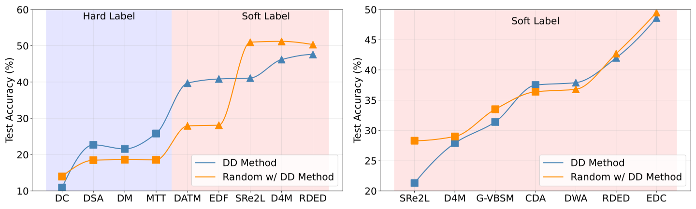

Welcome to **DD-Ranking** (DD, *i.e.*, Dataset Distillation), an integrated and easy-to-use evaluation benchmark for dataset distillation! It aims to provide a fair evaluation scheme for DD methods that can decouple the impacts from knowledge distillation and data augmentation to reflect the real informativeness of the distilled data.

## Motivation
Dataset Distillation (DD) aims to condense a large dataset into a much smaller one, which allows a model to achieve comparable performance after training on it. DD has gained extensive attention since it was proposed. With some foundational methods such as DC, DM, and MTT, various works have further pushed this area to a new standard with their novel designs.

Notebaly, more and more methods are transitting from "hard label" to "soft label" in dataset distillation, especially during evaluation. **Hard labels** are categorical, having the same format of the real dataset. **Soft labels** are outputs of a pre-trained teacher model. 
Recently, Deng et al., pointed out that "a label is worth a thousand images". They showed analytically that soft labels are exetremely useful for accuracy improvement. 

However, since the essence of soft labels is **knowledge distillation**, we find that when applying the same evaluation method to randomly selected data, the test accuracy also improves significantly (see the figure above).

This makes us wonder: **Can the test accuracy of the model trained on distilled data reflect the real informativeness of the distilled data?**

We summaize the evaluation configurations of existing works in the following table, with different colors highlighting different values for each configuration.

As can be easily seen, the evaluation configurations are diverse, leading to unfairness of using only test accuracy to demonstrate one's performance.
Among these inconsistencies, two critical factors significantly undermine the fairness of current evaluation protocols: label representation (including the corresponding loss function) and data augmentation techniques.

Motivated by this, we propose DD-Ranking, a new benchmark for DD evaluation. DD-Ranking provides a fair evaluation scheme for DD methods that can decouple the impacts from knowledge distillation and data augmentation to reflect the real informativeness of the distilled data.

## Features

- **Fair Evaluation**: DD-Ranking provides a fair evaluation scheme for DD methods that can decouple the impacts from knowledge distillation and data augmentation to reflect the real informativeness of the distilled data.
- **Easy-to-use**: DD-Ranking provides a unified interface for dataset distillation evaluation.
- **Extensible**: DD-Ranking supports various datasets and models.
- **Customizable**: DD-Ranking supports various data augmentations and soft label strategies.

## DD-Ranking Benchmark

Revisit the original goal of dataset distillation: 
> The idea is to synthesize a small number of data points that do not need to come from the correct data distribution, but will, when given to the learning algorithm as training data, approximate the model trained on the original data. (Wang et al., 2020)
>

### Label-Robust Score (LRS)
For the label representation, we introduce the Label-Robust Score (LRS) to evaluate the informativeness of the synthesized data using the following two aspects:
1. The degree to which the real dataset is recovered under hard labels (hard label recovery): \\( \text{HLR}=\text{Acc.}{\text{real-hard}}-\text{Acc.}{\text{syn-hard}} \\).  

2. The improvement over random selection when using personalized evaluation methods (improvement over random): \\( \text{IOR}=\text{Acc.}{\text{syn-any}}-\text{Acc.}{\text{rdm-any}} \\).
\\(\text{Acc.}\\) is the accuracy of models trained on different samples. Samples' marks are as follows:
- \\(\text{real-hard}\\): Real dataset with hard labels;
- \\(\text{syn-hard}\\): Synthetic dataset with hard labels;
- \\(\text{syn-any}\\): Synthetic dataset with personalized evaluation methods (hard or soft labels);
- \\(\text{rdm-any}\\): Randomly selected dataset (under the same compression ratio) with the same personalized evaluation methods.

LRS is defined as a weight sum of \\(\text{IOR}\\) and \\(-\text{HLR}\\) to rank different methods:
\\[
\alpha = w\text{IOR}-(1-w)\text{HLR}, \quad w \in [0, 1]
\\]
Then, the LRS is normalized to \\([0, 1]\\) as follows:
\\[
\text{LRS} = (e^{\alpha}-e^{-1}) / (e - e^{-1}) \times 100 \\%
\\]

By default, we set \\(w = 0.5\\) on the leaderboard, meaning that both \\(\text{IOR}\\) and \\(\text{HLR}\\) are equally important. Users can adjust the weights to emphasize one aspect on the leaderboard.

### Augmentation-Robust Score (ARS)
To disentangle data augmentation’s impact, we introduce the augmentation-robust score (ARS) which continues to leverage the relative improvement over randomly selected data. Specifically, we first evaluate synthetic data and a randomly selected subset under the same setting to obtain \\(\text{Acc.}{\text{syn-aug}}\\) and \\(\text{Acc.}{\text{rdm-aug}}\\) (same as IOR). Next, we evaluate both synthetic data and random data again without the data augmentation, and results are denoted as \\(\text{Acc.}{\text{syn-naug}}\\) and \\(\text{Acc.}{\text{rdm-naug}}\\).
Both differences, \\(\text{Acc.syn-aug} - \text{Acc.rdm-aug}\\) and \\(\text{Acc.syn-naug} - \text{Acc.rdm-naug}\\), are positively correlated to the real informativeness of the distilled dataset.

ARS is a weighted sum of the two differences:
\\[
\beta = \gamma(\text{Acc.syn-aug} - \text{Acc.rdm-aug}) + (1 - \gamma)(\text{Acc.syn-naug} - \text{Acc.rdm-naug})
\\]
and normalized similarly.

